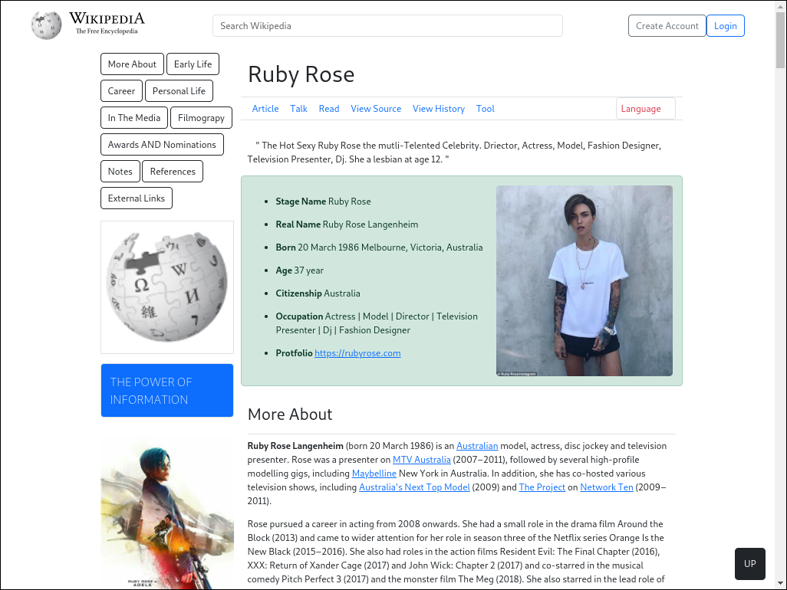

# Clone-1

- Name : "Wikipedia"

- Description : "try to copy wekipedia to develope better Version"

- Version : 1.2

- Update : 30-05-2023

- Status : REST

- Responsive : Ture

- TecStack : { HTML | Bootstrap }

- Thanks : { VSCode | GitHub | Bootstrap | Wikipedia }

- Work : Self

- Design : { Mayank }

- Developer : { Mayank }

- CopyRight : { Wikipedia }

- URL : https://mayankdevil.github.io/clone-1/

- Clone : https://github.com/MayankDevil/clone-1.git

- Download : https://github.com/MayankDevil/clone-1/archive/refs/heads/main.zip

---

### Home Page

## NOTE

_this repository is the clone of **wikiepedia**. I am just try to copy and develope to make better version as my imagination because i am developer_S

